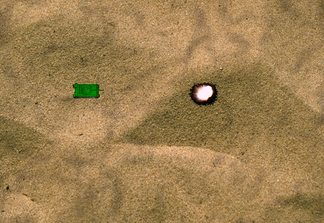
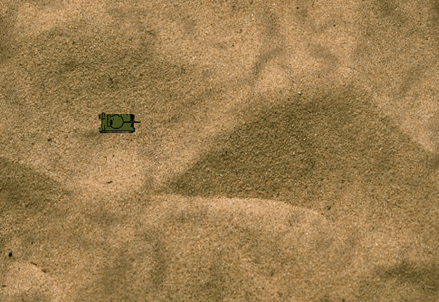

# Tank

A Windows tank demo written in C++ with MFC and DirectDraw. Move the tank, rotate its turret, and fire projectiles in 16 directions.

## Screenshot



## Gameplay



The images come from the game's DirectDraw render buffer. The GIF combines sampled frames of a shot and its explosion.

## Controls

| Key | Action |
| --- | --- |
| Arrow keys | Turn the tank toward that direction, then move |
| Space | Rotate the hull and turret together |
| Home / End | Rotate the turret counterclockwise / clockwise |
| Enter / Shift | Fire |
| Esc | Close the game |

Each shot starts at the visible muzzle for the selected turret sprite. Moving or rotating after firing leaves the projectile's launch position and direction fixed. A new shot is available after the explosion finishes.

## Build

The current project has been built with Visual Studio 2026 on Windows. Install the C++ desktop development tools, the MSVC v145 toolset, MFC support for that toolset, and a Windows 10/11 SDK.

Open `Tank.sln`, select **Win32** and either **Debug** or **Release**, then build. The executable and bitmap assets are written to the corresponding output folder.

From a Visual Studio Developer PowerShell, you can also build with:

```powershell
msbuild Tank.sln /p:Configuration=Release /p:Platform=Win32
```

## Run

Use F5 in Visual Studio, or launch the executable with its output folder as the working directory:

```powershell
Set-Location Release
.\Tank.exe
```

Keep the copied `.bmp` files alongside the executable. The game uses the dynamically linked MFC and CRT libraries; their matching x86 runtime must be available on the machine. Debug builds require the development runtime supplied by Visual Studio.

See [the firing fix notes](docs/shot-fix.md) for implementation details and validation.
